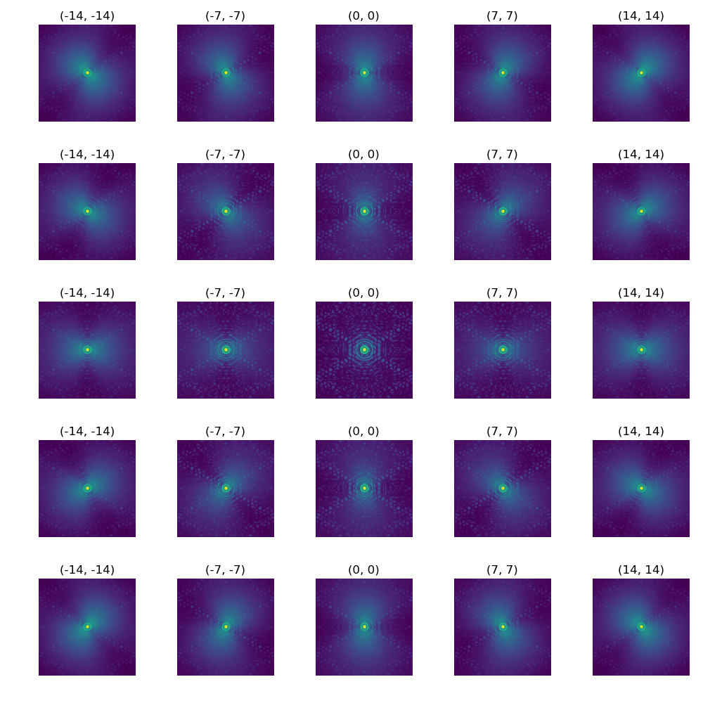

# Summary

AnisoCADO is a Python package for generating images of the point spread function (PSF) for the european extremely large telescope. 
The code allows the user to set a large range of the most important atmospheric and observational parameters that influence the shape and strehl ratio of the resulting PSF, including but not limited to: the atmospheric turbulence profile, the guide star position for a single conjugate adaptive optics (SCAO) solution, differential telescope pupil transmission, etc.
Documentation can be found at https://anisocado.readthedocs.io/en/latest/

# Statement of need

## Adaptive optics are mandatory for the next generation of ground-based telescopes
The larger the telescope aperture, the smaller the diffraction limit of the observations. 
For space-based telescope this statement is always true. 
However the resolution of ground based telescopes is limited by the blur caused by turbulence in the atmosphere - known as atmospheric Seeing. 
This blurring can be (mostly) removed by measuring the deformation of the wavefront of the incoming light, and applying an equal and opposite deformation to the surface of one or more of the mirrors along a telescope's optical path.
The current fleet of large (8-10m) telescopes were built to primarily operate at the edge of the natural seeing limit (FWHM~0.5 arcseconds @ 1um). 
Over the last two decades some have received upgrades in the form of active and adaptive mirrors in order to achieve up to 20x increase in resolution afforded by the physical diffraction limit of a ~10m primary mirror (FWHM~0.03 arcseconds @ 1um).
The next generation of "extremely large" telescopes will have primary mirrors on the order of 30-40m, with theoretical diffraciton limits on the order of 50x smaller than the natural Seeing limit.
In order for these telescopes to resolve structures at scales of the diffraction limit, they must, by design, include adaptive optics systems.

## Diffraction limited point-spread-functions are complex beasts
The point spread function (PSF) of an optical system is the description of the spatial distribution of light from an infinitely small point source after passing through an optical system (e.g. layers of the atmosphere, mirrors of a telescope).
Due to the random nature of atmospheric turbulence, the PSF of a star in a Seeing-limited observation is well approximated by a ("nice") smooth Gaussian-like function.
The PSF of a diffraction limited telescope system using an adaptive-optics correction is a complex ("ugly") function that depends on a veritible zoo of atmospheric, observational, and technical parameters. 
From an astronomers point of view, the consequences of a poor adaptive optics solution means the difference between a successful and a failed observation run.
Therfore it is imperative that the consequences of such large variations in the PSF are accounted for in advance by those proposing to observe with this next generation of billion-dollar telescopes.

## AnisoCADO - Anisoplanatism for MICADO

AnisoCADO (Anisoplanatism for MICADO) is a package for generating images of the point spread function for a given set of atmospheric, observational, and technical conditions.
It does this by combining a series of wavefront phase screens from the elements of the atmosphere and AO system that influence the final AO correction (e.g. atmospheric anisoplantism, WFS aliasing, actuator fit, etc). 
The final phase screen is applied to the optical transfer function for the telescope optical system. 
The resulting image is the expected PSF for a long exposure (>10s) on-axis observation at the given wavelength.
For single-conjugate adaptive optics modes, the field PSF degrades as distance from the guide star increases. 
This effect is taken into account by shifting the anisoplanatic phase screen relative to the calculated phase screen correction for the deformable mirror. 
Figure \autoref{fig:psf_grid} shows how the PSF changes with distance from an on-axis guide star.   
For a more detailed discussion of the mathematics behind anisoplanatism in the context of the ELT, the reader is referred to @clenet2015.

### Inputs
The final ELT PSF is the combination of many factors. The vast majority of these are irrelevant for the casual user. 
AnisoCADO therefore provides three preset option, corresponding to the standard ESO Q1, Median and Q4 turbulence profiles.
All other parameters are initialised with default values.
The most important factor

Atmospheric
* atmospheric turbulence profile
* height and relative strength of each turbulent layer 
* wind speed
* outer scale
* Seeing FWHM @ 500nm
* Fried parameter

Observational
* natural guide star position
* central wavelength
* pupil rotation angle
* Zenith distance of observation

Technical
* pupil image
* spatially differing pupil transmissivity
* dead/empty mirror segments
* plate scale
* residual wavefront error of the system
* AO sampling frequency
* AO loop delay
* Interactuator distance

### Outputs

AnisoCADO is easily integrated into the standard astronomers toolbox. 
PSF images generated by AnisoCADO can be output as either ``numpy`` arrays, or standard ``astropy.io.fits.ImageHDU`` objects. 
The latter can be written to file using the standard ``astropy`` syntax.

As AnisoCADO was written to support the development of the MICADO instrument simulator [@simcado2016; @simcado2019], it is also possible to generate ``FieldVaryingPSF`` objects using the helper functions in the ``misc`` module.
Such files are also compatible with the generic instrument data simulator framework, ScopeSim [@scopesim].

# Acknowledgments

AnisoCADO uses the following packages as dependencies: 
Numpy [@numpy],
Matplotlib [@numpy],
Astropy [@astropy2018].

This development of this project was funded by the project IS538003 of the Hochschulraum-strukturmittel (HRSM) provided by the Austrian Government and administered by the University of Vienna.

# References

