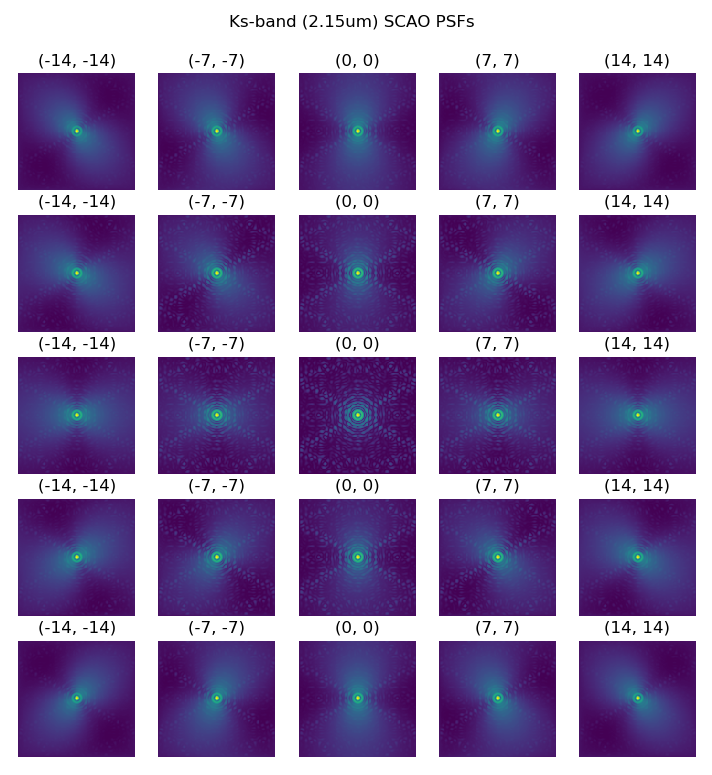

Welcome to AnisoCADO's documentation!
=======================================

AnisoCADO is the python package created around Eric Gendron's code for
analytically generating field-varying SCAO PSFs for MICADO at the ELT.

    A grid of SCAO PSFs at 2.15um covering 14 arcsec on the MICADO field of view

.. toctree::
   :maxdepth: 2
   :caption: Contents:

   GettingStarted
   Reference API <reference/anisocado>

.. warning:: While the code for this package exists, I haven't yet compiled it
    into a ``pip install`` -able package. The should happen very soon.

Basic Usage
-----------

.. note:: See Getting Started for a more in-depth introduction

The most needed functionality is based around the ``AnalyticalScaoPsf`` class.
Create one like this::

    from anisocado import AnalyticalScaoPsf
    psf = AnalyticalScaoPsf(N=512, wavelength=2.15)     # wavelength in um

where (for the moment) ``N`` is the side length of the PSF kernel image and
``wavelength`` is the central wavelength [um] of the PSF that we wish to
simulate

.. plot::

    import matplotlib.pyplot as plt
    from matplotlib.colors import LogNorm
    from anisocado import AnalyticalScaoPsf
    psf = AnalyticalScaoPsf(N=512, wavelength=2.15)
    plt.imshow(psf.psf_latest)

When we create an AnalyticalScaoPsf object, an initial PSF is created that is
on-axis. This can be accessed with the ``.psf_on_axis`` attribute.

To "move" the PSF off-axis, we call the ``.shift_off_axis(dx, dy)`` method.
Here ``dx, dy`` are in arcseconds.::

    psf.shift_off_axis(10, -5)

We can access this PSF in two ways: as a numpy array with ``.kernel`` or as an
astropy ``ImageHDU`` object with ``.hdu``. Here the kernel is kept in the
``.data`` attribute, while the header contains all the parameters used to
create the PSF kernel::

    psf.kernel
    psf.hdu.data

Write PSF to a FITS file
++++++++++++++++++++++++
Given that the PSF can create an astropy ``ImageHDU`` object, we can take
advantage of the astropy functionality and and override the ``.writeto()``
method of an astropy ``ImageHDU`` object::

    psf.writeto(filename="My_SCAO_PSF.fits")

Obviously this will only work for single PSFs. We will normally want to create
multiple SCAO PSFs for different wavelengths and different positions over the
field of view. To do this we can simply loop over a series of coordinates and
add the ``HDUs`` to an astropy ``HDUList`` object.::

    from astropy.io import fits
    from anisocado import AnalyticalScaoPsf

    psf = AnalyticalScaoPsf(N=256, wavelength=1.2)    # um
    hdus = []
    for x in range(-25, 26, 5):
        for y in range(-25, 26, 5):
            psf.shift_off_axis(x, y)
            hdus += [psf.hdu]

    hdu_list = fits.HDUList(hdus)
    hdu_list.writeto(filename="My_bunch_of_SCAO_PSFs.fits)

Installation
------------
::

    pip install anisocado

Dependencies
------------

The following packages are required for normal operation:

* ``numpy (>=1.13)``
* ``astropy``

The following packages are optional:

* ``matplotlib``

Indices and tables
==================

* :ref:`genindex`
* :ref:`modindex`
* :ref:`search`
